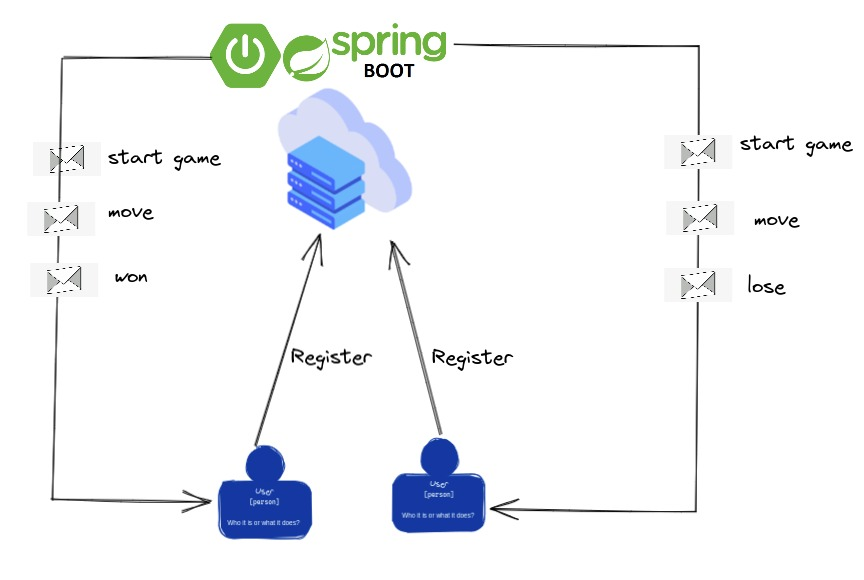
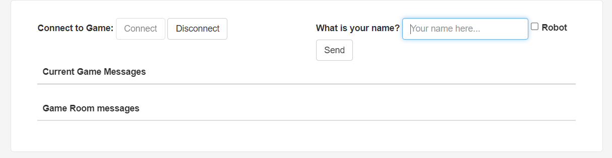
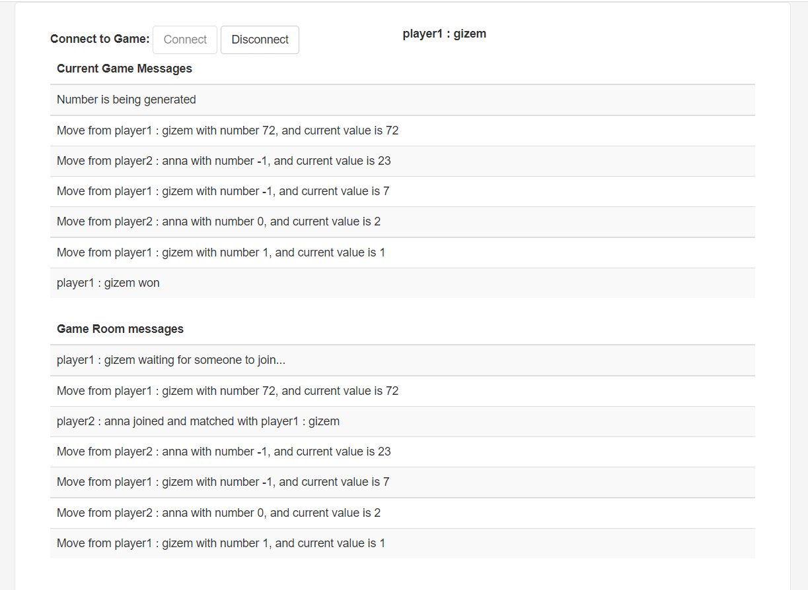

# Game of Tree, What is it?
This is a web application implemented based on spring framework using websockets/STOMP protocol.

The intention is to have multiple users connected as client, and server side notifications to the clients via websockets.

## Prerequisites
* [java](https://yarnpkg.com/getting-started/install) (at least jdk version 11)
* [lombok](https://projectlombok.org/) reduce the boilerplate code, for installation in your idea please follow the [steps](https://www.baeldung.com/lombok-ide)

## Design


Obs: Usually with STOMP is better to connect with a message broker such as rabbit mq, but aiming to make the project easy to run, this project
uses an in memory broker.

## Installing dependencies
```bash
./gradlew build
```

## Tests and checks
To run all tests:
```bash
./gradlew test
```

## Run locally
To start the service locally at http://localhost:8080
```bash
./gradlew bootRun
```

## How to interact with it:
For better demonstration purposes, this project contains an embedded frontend application.
After run the project, please open your browser and access http://localhost:8080 you will be able to see and interact with the game application.

## Game Welcome View:


## Game Over View:
